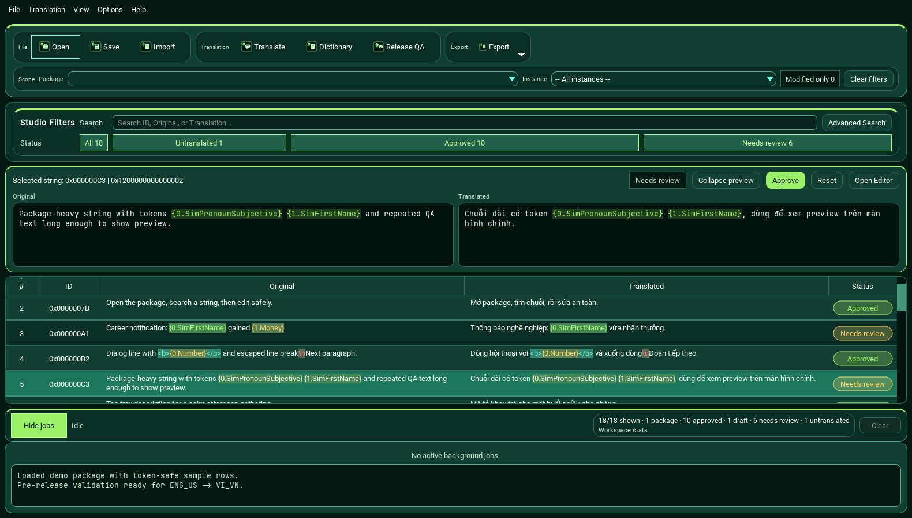
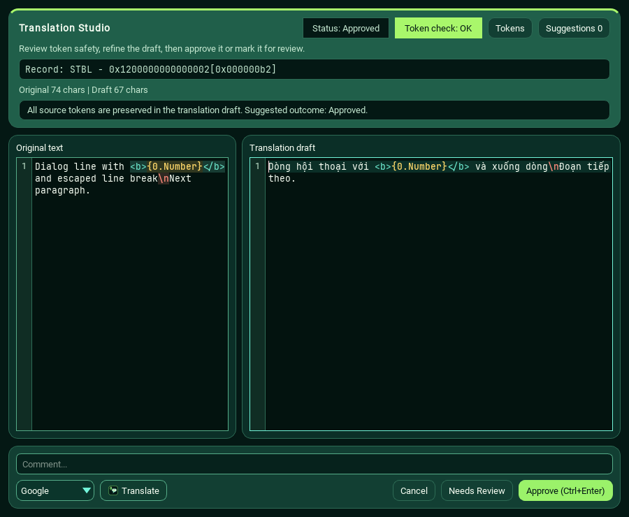
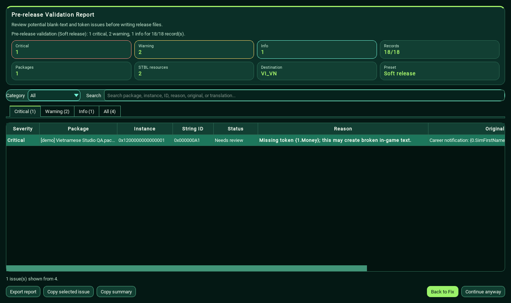

# The Sims 4 Translator Plus

[](https://github.com/anhtahaylove/sims4-translator/releases/latest)
[](https://github.com/anhtahaylove/sims4-translator/actions/workflows/ci.yml)
[](https://github.com/anhtahaylove/sims4-translator/releases/latest)
[](LICENSE)

**Vietnamese-first translation studio for Sims 4 mods and packages.**

Open a package, translate the strings, keep Sims tokens safe, validate your release, and export a clean package for testing in Mods.

[Tiếng Việt](README.vi.md) · [Download for Windows](https://github.com/anhtahaylove/sims4-translator/releases/latest) · [Trust & Safety](docs/trust-and-safety.md) · [Docs](docs/README.md) · [Release checklist](docs/release-checklist.md)

> Community project notice: this app is not affiliated with Electronic Arts, Maxis, The Sims, or the original upstream maintainer. It does not include official game artwork, logos, fonts, or assets.


## Safe Download And Verification

Only download the app from the official [GitHub Releases](https://github.com/anhtahaylove/sims4-translator/releases/latest) page. The source code is public, Windows builds are checked by GitHub Actions, and each release ZIP includes a matching `.sha256` checksum. Newer releases also include a `.sigstore.json` bundle for provenance verification.

Quick verification:

```powershell
Get-FileHash .\The-Sims-4-Translator-Plus-vX.Y.Z-windows.zip -Algorithm SHA256
```

Compare the displayed hash with the `.sha256` file attached to the same release. You can also run `scripts\verify_release_download.ps1 -Latest` from the source checkout to download, verify, extract, and smoke-test the release ZIP.

Advanced verification is available for release builds created by GitHub Actions:

```powershell
scripts\verify_release_download.ps1 -Latest -VerifyProvenance
```

This additionally checks GitHub Artifact Attestations and the Sigstore/cosign bundle attached to the release. These signatures prove release provenance; they do not replace Windows Authenticode code signing.

For group admins or cautious users: check that the link points to `github.com/anhtahaylove/sims4-translator`, the release has ZIP, `.sha256`, and `.sigstore.json` assets, and the latest `main` CI badge is passing. More details: [Trust & Safety](docs/trust-and-safety.md).

The Windows app is not code-signed yet, so SmartScreen may show a warning. That warning means the executable has low reputation, not that the source or checksum failed.
Some antivirus engines may also flag unsigned PyInstaller apps with static or ML heuristics; see the source, checksum, GitHub attestation, Sigstore/cosign bundle, and [false-positive review notes](docs/false-positive-submissions.md) before deciding whether to run it.

## Download In 3 Steps

1. Go to the [latest release](https://github.com/anhtahaylove/sims4-translator/releases/latest).
2. Download the Windows ZIP. The filename looks like `The-Sims-4-Translator-Plus-vX.Y.Z-windows.zip`.
3. Extract the ZIP, then run `The Sims 4 Translator Plus.exe`.

Do not run the app from inside the ZIP. Extract it first so the app can read its bundled `prefs` and `fonts` folders.

Need help? [Report a problem](https://github.com/anhtahaylove/sims4-translator/issues) or read the [contributing guide](CONTRIBUTING.md).

## System Requirements

| Requirement | Notes |
| --- | --- |
| Windows | Windows 10 or newer is the supported target for the packaged app. |
| Internet | Optional. Needed only for online translation providers such as DeepL, Google, or MyMemory. |
| DeepL key | Optional. Add one only if you want DeepL translation, usage checks, or glossary support. |
| Source build | Source users need Python and the packages in `requirements.txt`; the repo does not pin an exact Python version. |

## What Can I Do With It?

| You want to... | The app helps you... |
| --- | --- |
| Translate packages | Open `.package` or `.stbl` files and edit strings in a table-first workspace. |
| Work faster | Search by ID, original text, or translated text from one hybrid search box. |
| Read long strings | Use Selection Preview to see the full selected string without opening the editor. |
| Avoid broken text | Highlight Sims tokens like `{0.SimFirstName}`, `\n`, `<b>`, and `<i>`. |
| Use machine translation | Connect DeepL, Google, or MyMemory, with DeepL usage checks and batch cost warnings. |
| Release more safely | Run Validate Release before Save as package, Export, or Finalize. |

## A Quick Look

### Table-first workspace

Search, filter, preview, and review large packages without leaving the main window.



### Translation Studio editor

Edit one string in a focused editor with token highlighting, token safety, comments, and quick approve or needs-review actions.



### Validate before you publish

The validation report catches blank translations, missing tokens, risky statuses, duplicate output, and resource issues before files are written.



## Typical Vietnamese Workflow

The first-run defaults are set for Vietnamese localization:

```text
Source: ENG_US
Destination: VI_VN
```


_Recommended flow for a safer Mods-folder release._

Recommended flow:

1. Open one or more `.package` or `.stbl` files.
2. Translate and review strings in the table.
3. Use the editor for long text, token-heavy text, or strings that need careful review.
4. Run **Validate Release**.
5. Use **Save as package** to create a Mods-folder package.
6. Test the output in:

```text
Documents\Electronic Arts\The Sims 4\Mods
```

Use **Finalize** only when you deliberately want to rewrite or finalize package resources. Keep backups if you use that workflow.

For a deeper publish checklist, see [docs/release-checklist.md](docs/release-checklist.md).

## Known Limitations And Safety Notes

- Machine translation is a draft. Review important strings before publishing.
- Keep Sims runtime tokens, line breaks, and formatting tags intact.
- Use **Finalize** deliberately and keep backups, especially when working with full game or DLC-sized packages.
- This project is a community tool and does not include official game files or assets.

## Save As Package Or Finalize?

| Option | Best for | Notes |
| --- | --- | --- |
| **Save as package** | Most translators and public Mods-folder releases | Safer default. Produces a package you can put in `Documents\Electronic Arts\The Sims 4\Mods`. |
| **Finalize** | Advanced package workflows | Writes destination resources into a package. Use it only when you know this is the output style you want. |
| **Export** | Sharing or reviewing translation data | Useful for XML, JSON, CSV, Binary, and tool-specific workflows. |

For full game or DLC-sized Vietnamese releases, prefer **Save as package** first, then test in a clean Mods folder.

## Token Safety In Plain English

Sims strings often contain special pieces that the game reads at runtime:

```text
{0.SimFirstName}
{1.Money}
\n
<b>important text</b>
...
```

If a translation removes or changes those pieces, the game can show incorrect text or blank UI. The app highlights these parts and warns you when the translation no longer matches the original.


_Original stays in English. Translation can be Vietnamese, but runtime tokens still need to match._

The important idea is simple: translate the human-readable words, but keep the runtime tokens, line breaks, and tags intentionally preserved.

## DeepL Setup

DeepL is optional. You can still use the app without a DeepL key.

To use it:

1. Open **Options**.
2. Paste your **DeepL API key**.
3. Click **Test key** to confirm the key works.
4. Click **Check usage** before big batch jobs.
5. Optional: paste a **Glossary ID** if you already created a DeepL glossary for consistent game terms.

Before DeepL batch translation starts, the app estimates how many source characters will be sent so you can avoid spending quota by accident.

## Supported Formats

| Direction | Formats |
| --- | --- |
| Open | `.package`, `.stbl`, XML, JSON, Binary |
| Import translation | XML, JSON, Binary, CSV-style translation data |
| Export translation | STBL package, XML, XML-DP, JSON, Binary, Hub CSV |
| QA reports | Text or CSV validation reports |
| Dictionaries | Built from installed Sims 4 pack string resources |

## For Developers

You only need this section if you want to run from source or build the Windows app yourself.

<details>
<summary>Run from source</summary>

```powershell
python -m pip install -r requirements.txt
python main.py
```

</details>

<details>
<summary>Verify the project</summary>

```powershell
python -m unittest discover -s tests -v
python -m compileall -q models packer singletons storages themes utils widgets windows tests scripts main.py
python scripts\create_synthetic_package.py
python scripts\verify_synthetic_smoke.py --directory build\synthetic --require-gui-outputs
git diff --check
```

</details>

<details>
<summary>Build the Windows executable</summary>

```powershell
powershell -NoProfile -ExecutionPolicy Bypass -File scripts\build_windows.ps1
```

The build script uses PyInstaller as a build-only tool in a temporary virtual environment. It does not add PyInstaller as a runtime dependency.

</details>

## Troubleshooting

| Problem | Try this |
| --- | --- |
| The app does not start from the ZIP | Extract the ZIP first, then run the EXE from the extracted folder. |
| Destination is not Vietnamese | Open **Options** and set Destination to `VI_VN`. Fresh first-run installs default to `ENG_US -> VI_VN`. |
| DeepL does not translate | Use **Test key** and **Check usage** in Options, then confirm DeepL is selected in the translate dialog. |
| Validate Release shows critical issues | Open the issue, fix missing tokens or blank translations, then run validation again. |
| In-game text is blank | Check token warnings, destination locale, and whether the output package was tested from the Mods folder. |
| You need a diagnostic log | Check `%APPDATA%\The Sims 4 Translator Plus\logs\app.log`. API keys are redacted before writing. |
| Windows SmartScreen warns about the app | The ZIP is currently unsigned. Verify the `.sha256` file from the GitHub Release before running. |

## Credits

The Sims 4 Translator Plus is a community-maintained fork of [voky1/sims4-translator](https://github.com/voky1/sims4-translator), redesigned around a Vietnamese-first translation workflow.

This repository is licensed under the [MIT License](LICENSE).
