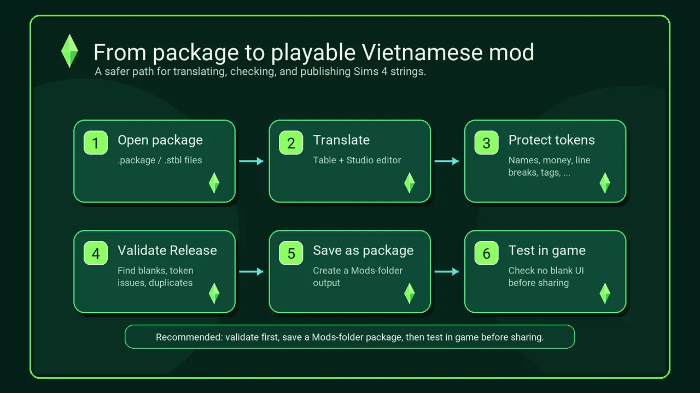
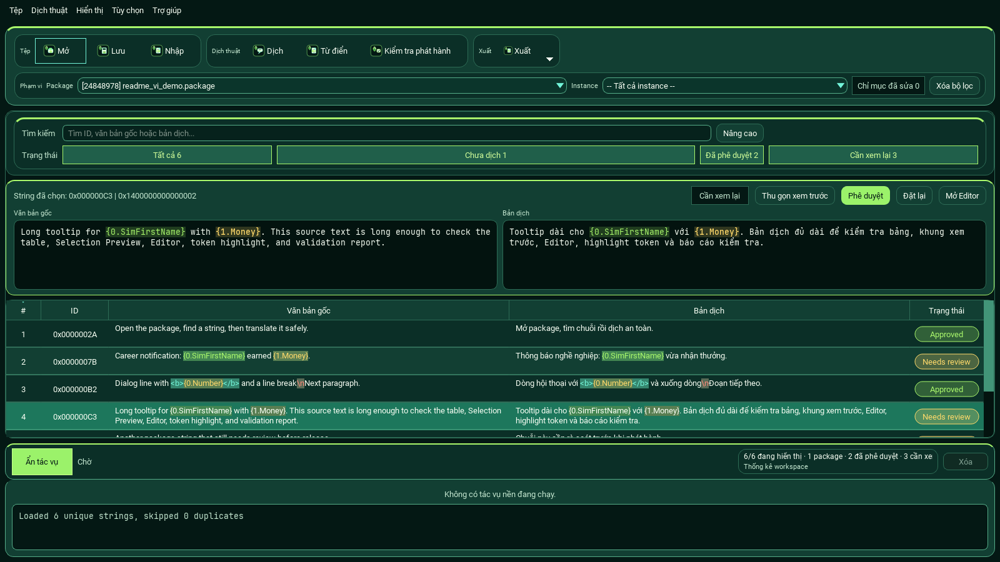
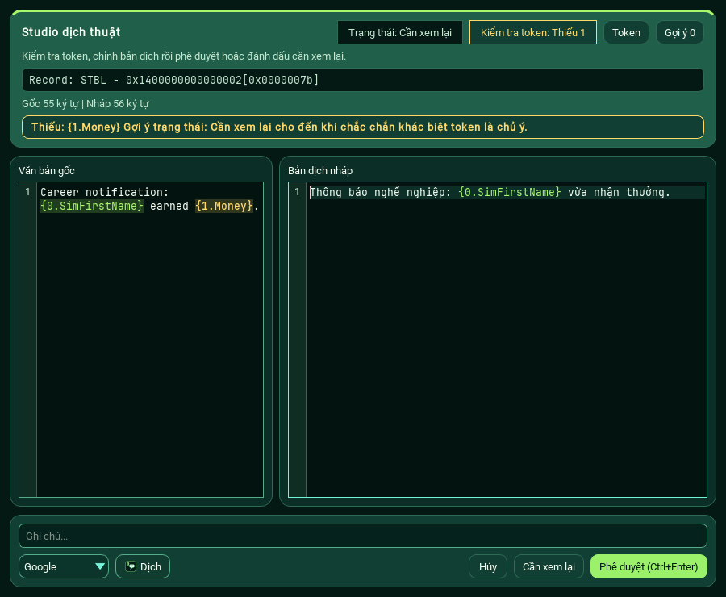
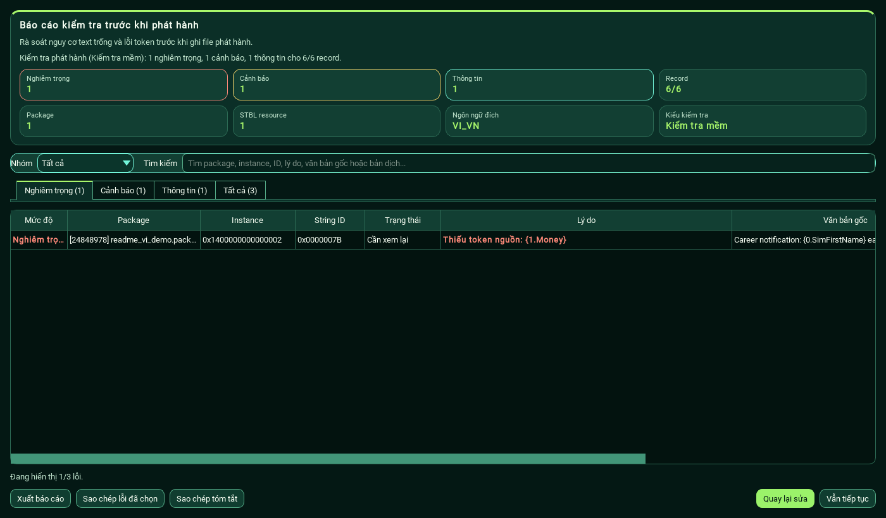
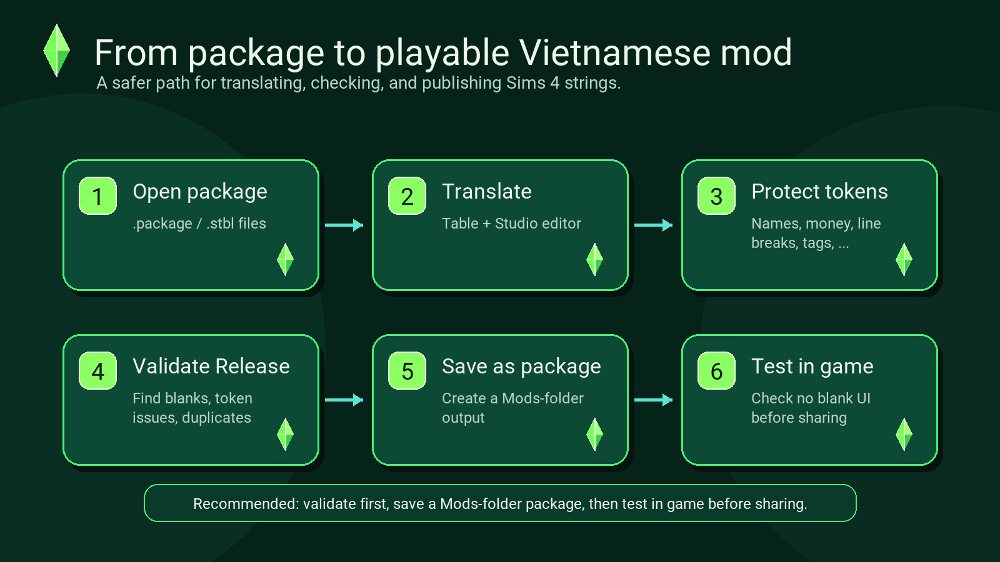
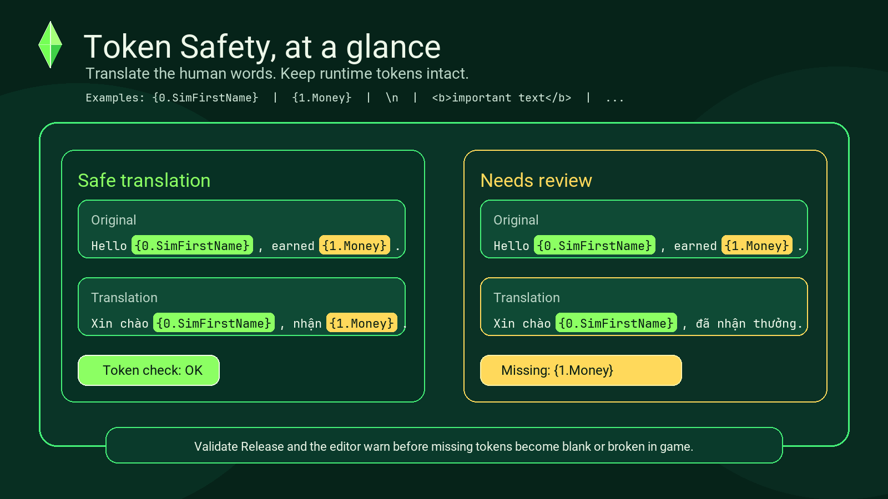

# The Sims 4 Translator Plus

[](https://github.com/anhtahaylove/sims4-translator/releases/latest)
[](https://github.com/anhtahaylove/sims4-translator/actions/workflows/ci.yml)
[](https://github.com/anhtahaylove/sims4-translator/releases/latest)
[](LICENSE)

**Translation Studio ưu tiên Việt hóa cho mod và package The Sims 4.**

Mở package, dịch string, giữ an toàn token của game, kiểm tra trước khi xuất bản, rồi tạo package để test trong thư mục Mods.

[English](README.md) · [Tải bản Windows](https://github.com/anhtahaylove/sims4-translator/releases/latest) · [Trust & Safety](docs/trust-and-safety.md) · [Docs](docs/README.md) · [Checklist phát hành](docs/release-checklist.md)

> Lưu ý cộng đồng: ứng dụng này không liên kết chính thức với Electronic Arts, Maxis, The Sims hoặc maintainer upstream ban đầu. Repo không chứa artwork, logo, font hoặc asset chính thức của game.


## Tải An Toàn Và Tự Kiểm Chứng

Chỉ tải app từ trang [GitHub Releases chính thức](https://github.com/anhtahaylove/sims4-translator/releases/latest). Source code được public, bản Windows được kiểm tra bằng GitHub Actions, và mỗi release ZIP có file `.sha256` đi kèm. Các release mới cũng có bundle `.sigstore.json` để kiểm chứng provenance.

Kiểm tra nhanh trên PowerShell:

```powershell
Get-FileHash .\The-Sims-4-Translator-Plus-vX.Y.Z-windows.zip -Algorithm SHA256
```

So sánh hash hiển thị với file `.sha256` trong cùng release. Nếu tải source repo, bạn cũng có thể chạy `scripts\verify_release_download.ps1 -Latest` để script tự tải, kiểm checksum, giải nén và smoke-test file ZIP release.

Nếu muốn kiểm chứng sâu hơn với bản release được build bằng GitHub Actions:

```powershell
scripts\verify_release_download.ps1 -Latest -VerifyProvenance
```

Lệnh này kiểm thêm GitHub Artifact Attestations và bundle Sigstore/cosign đi kèm release. Đây là bằng chứng provenance của artifact, không thay thế Windows Authenticode code signing.

Dành cho admin group hoặc người muốn kiểm duyệt link: kiểm tra link có trỏ về `github.com/anhtahaylove/sims4-translator`, release có đủ ZIP, `.sha256`, `.sigstore.json`, và badge CI của `main` đang pass. Xem thêm: [Trust & Safety](docs/trust-and-safety.md).

App Windows hiện chưa code-sign nên SmartScreen có thể cảnh báo. Cảnh báo này thường do file exe chưa có reputation, không đồng nghĩa source hoặc checksum bị sai.
Một số engine antivirus cũng có thể flag app PyInstaller chưa ký bằng heuristic hoặc ML; hãy xem source, checksum, GitHub attestation, bundle Sigstore/cosign và [ghi chú false-positive](docs/false-positive-submissions.md) trước khi quyết định chạy app.

## Tải Và Chạy Trong 3 Bước

1. Mở [trang release mới nhất](https://github.com/anhtahaylove/sims4-translator/releases/latest).
2. Tải bản ZIP cho Windows. Tên file thường có dạng `The-Sims-4-Translator-Plus-vX.Y.Z-windows.zip`.
3. Giải nén ZIP, rồi chạy `The Sims 4 Translator Plus.exe`.

Không chạy app trực tiếp bên trong file ZIP. Hãy giải nén trước để app đọc được thư mục `prefs` và `fonts` đi kèm.

Bạn cần hỗ trợ? Hãy [báo lỗi hoặc góp ý](https://github.com/anhtahaylove/sims4-translator/issues), hoặc xem [hướng dẫn đóng góp](CONTRIBUTING.md).

## Cách Dùng Nhanh Trong 5 Bước

1. Mở app và chọn **Open** để mở file `.package` hoặc `.stbl`.
2. Chọn string cần dịch trong bảng, rồi xem đầy đủ nội dung ở Selection Preview.
3. Mở **Translation Studio** để sửa string dài hoặc string có nhiều token.
4. Chạy **Validate Release** để rà lỗi text trống, token và trạng thái cần xem lại.
5. Dùng **Save as package**, bỏ file xuất ra vào thư mục Mods rồi test trong game.



## Yêu Cầu Hệ Thống

| Yêu cầu | Ghi chú |
| --- | --- |
| Windows | Bản exe đóng gói hướng tới Windows 10 trở lên. |
| Internet | Không bắt buộc. Chỉ cần khi dùng dịch online như DeepL, Google, MyMemory, Gemini hoặc OpenAI-compatible endpoint. Ollama có thể chạy local sau khi tải model. |
| Provider key | Không bắt buộc. Chỉ thêm key cho provider bạn muốn dùng; Ollama không cần API key. |
| Chạy từ source | Người dùng source cần Python và các package trong `requirements.txt`; repo chưa pin một phiên bản Python cụ thể. |

## App Này Giúp Bạn Làm Gì?

| Bạn muốn... | App giúp bạn... |
| --- | --- |
| Dịch package | Mở `.package` hoặc `.stbl` và dịch bằng workspace dạng bảng. |
| Tìm string nhanh | Tìm bằng ID, text gốc hoặc bản dịch trong cùng một ô tìm kiếm hybrid. |
| Đọc string dài | Xem đầy đủ string đang chọn ngay ở Selection Preview. |
| Tránh lỗi text trống | Highlight token như `{0.SimFirstName}`, `\n`, `<b>`, `<i>` và cảnh báo khi thiếu token. |
| Dùng dịch máy | Cấu hình DeepL, Google, MyMemory, Gemini, OpenAI-compatible endpoint hoặc Ollama local, có cache và cảnh báo chi phí trước batch lớn. |
| Xuất bản an toàn hơn | Chạy Validate Release trước khi Save as package, Export hoặc Finalize. |

## Xem Nhanh Giao Diện

### Workspace dạng bảng

Tìm kiếm, lọc, xem preview và xử lý package lớn mà không cần rời màn hình chính.



### Translation Studio

Sửa từng string trong editor tập trung, có highlight token, kiểm tra token safety, comment và nút Approve hoặc Needs Review.



### Kiểm tra trước khi phát hành

Validate Release giúp phát hiện bản dịch trống, thiếu token, trạng thái rủi ro, duplicate output và lỗi resource trước khi app ghi file.



## Workflow Việt Hóa Khuyến Nghị

Lần chạy đầu tiên được đặt sẵn cho workflow Việt hóa:

```text
Source: ENG_US
Destination: VI_VN
```



_Luồng khuyến nghị để tạo package an toàn hơn trước khi đưa vào thư mục Mods._

Luồng làm việc nên dùng:

1. Mở một hoặc nhiều file `.package` hoặc `.stbl`.
2. Dịch và rà soát string trong bảng.
3. Mở Editor cho string dài, string nhiều token hoặc string cần chỉnh kỹ.
4. Chạy **Validate Release**.
5. Dùng **Save as package** để tạo package đưa vào Mods.
6. Test output trong:

```text
Documents\Electronic Arts\The Sims 4\Mods
```

Chỉ dùng **Finalize** khi bạn thật sự muốn ghi/finalize resource vào package. Nếu dùng workflow đó, hãy giữ backup.

Nếu chuẩn bị phát hành bản Việt hóa công khai, xem thêm [docs/release-checklist.md](docs/release-checklist.md).

## Lưu Ý An Toàn Và Giới Hạn

- Dịch máy chỉ nên xem là bản nháp. Hãy rà soát các string quan trọng trước khi phát hành.
- Token runtime, ký hiệu xuống dòng và tag định dạng của game cần được giữ đúng.
- Chỉ dùng **Finalize** khi bạn thật sự hiểu workflow đó và luôn giữ backup.
- Đây là công cụ cộng đồng, không kèm file game hoặc asset chính thức.

## Save As Package Hay Finalize?

| Tùy chọn | Phù hợp khi | Ghi chú |
| --- | --- | --- |
| **Save as package** | Hầu hết workflow Việt hóa và release qua thư mục Mods | Đây là hướng an toàn hơn. Tạo package để bỏ vào `Documents\Electronic Arts\The Sims 4\Mods`. |
| **Finalize** | Workflow nâng cao với package/resource | Chỉ dùng khi bạn hiểu rõ kiểu output này và đã có backup. |
| **Export** | Chia sẻ hoặc rà soát dữ liệu dịch | Hữu ích cho XML, JSON, CSV, Binary hoặc workflow với tool khác. |

Với bản Việt hóa game/DLC lớn, nên ưu tiên **Save as package**, sau đó test trong một thư mục Mods sạch.

## Token Safety Là Gì?

String của The Sims 4 thường có những đoạn đặc biệt mà game dùng khi chạy:

```text
{0.SimFirstName}
{1.Money}
\n
<b>important text</b>
...
```

Nếu bản dịch làm mất hoặc đổi sai các đoạn này, game có thể hiện sai text hoặc bị trống UI. App sẽ highlight token và cảnh báo khi bản dịch không còn khớp với text gốc.



_Original giữ tiếng Anh gốc. Translation có thể là tiếng Việt, nhưng token runtime vẫn phải khớp._

Nói ngắn gọn: bạn có thể dịch câu chữ cho tự nhiên, nhưng token, xuống dòng và tag định dạng phải được giữ đúng ý đồ.

## Cấu Hình Provider Dịch

Provider dịch là tùy chọn. Không có API key thì bạn vẫn dùng app bình thường, và Ollama có thể chạy local trên máy bạn.

Cách dùng:

1. Mở **Tùy chọn**.
2. Dán key cho provider online bạn muốn dùng: DeepL, Gemini hoặc OpenAI-compatible endpoint.
3. Bấm nút test của provider để kiểm tra key.
4. Kiểm tra DeepL usage hoặc ngưỡng ký tự AI trước khi dịch batch lớn.
5. Tùy chọn: dán **Glossary ID** nếu bạn đã tạo glossary trên DeepL để giữ thuật ngữ game nhất quán.

Nếu muốn dịch local bằng Ollama:

1. Cài và mở [Ollama](https://ollama.com/).
2. Tải model khuyến nghị:

```powershell
ollama pull translategemma:12b
```

3. Trong **Tùy chọn**, bật **Ollama local provider**.
4. Bấm **Làm mới model Ollama**, giữ `translategemma:12b` hoặc nhập model local khác, rồi bấm **Kiểm tra Ollama**.

Trước khi Batch Translate bằng provider có quota/chi phí, app sẽ ước tính số ký tự nguồn sắp gửi để bạn tránh tốn quota ngoài ý muốn.

## Định Dạng Hỗ Trợ

| Hướng xử lý | Định dạng |
| --- | --- |
| Mở file | `.package`, `.stbl`, XML, JSON, Binary |
| Import bản dịch | XML, JSON, Binary, dữ liệu dịch dạng CSV |
| Export bản dịch | STBL package, XML, XML-DP, JSON, Binary, Hub CSV |
| Báo cáo QA | Text hoặc CSV validation report |
| Từ điển | Build từ string resource của các pack The Sims 4 đã cài |

## Dành Cho Developer

Phần này chỉ cần nếu bạn muốn chạy từ source hoặc tự build bản Windows.

<details>
<summary>Chạy từ source</summary>

```powershell
python -m pip install -r requirements.txt
python main.py
```

</details>

<details>
<summary>Kiểm tra project</summary>

```powershell
python -m unittest discover -s tests -v
python -m compileall -q models packer singletons storages themes utils widgets windows tests scripts main.py
python scripts\create_synthetic_package.py
python scripts\verify_synthetic_smoke.py --directory build\synthetic --require-gui-outputs
git diff --check
```

</details>

<details>
<summary>Build file exe Windows</summary>

```powershell
powershell -NoProfile -ExecutionPolicy Bypass -File scripts\build_windows.ps1
```

Script build dùng PyInstaller như dependency chỉ phục vụ build trong virtual environment tạm. PyInstaller không phải runtime dependency của app.

</details>

## Lỗi Thường Gặp

| Vấn đề | Cách xử lý |
| --- | --- |
| App không chạy khi mở từ ZIP | Giải nén ZIP trước, rồi chạy EXE trong thư mục đã giải nén. |
| Destination không phải tiếng Việt | Mở **Tùy chọn** và đặt Destination là `VI_VN`. Bản cài mới mặc định là `ENG_US -> VI_VN`. |
| DeepL không dịch | Dùng **Test key** và **Check usage** trong Tùy chọn, rồi kiểm tra đã chọn DeepL trong dialog dịch chưa. |
| Validate Release báo Critical | Mở issue, sửa token bị thiếu hoặc bản dịch trống, rồi validate lại. |
| Trong game bị trống text | Kiểm tra token warning, destination locale và test package từ thư mục Mods. |
| Cần log để báo lỗi | Xem `%APPDATA%\The Sims 4 Translator Plus\logs\app.log`. API key sẽ được che trước khi ghi log. |
| Windows SmartScreen cảnh báo | Bản ZIP hiện chưa code-sign. Hãy kiểm tra file `.sha256` trên GitHub Release trước khi chạy. |

## Credits

The Sims 4 Translator Plus là fork cộng đồng từ [voky1/sims4-translator](https://github.com/voky1/sims4-translator), được chỉnh lại cho workflow Việt hóa dễ dùng hơn.

Repo dùng giấy phép [MIT License](LICENSE).
